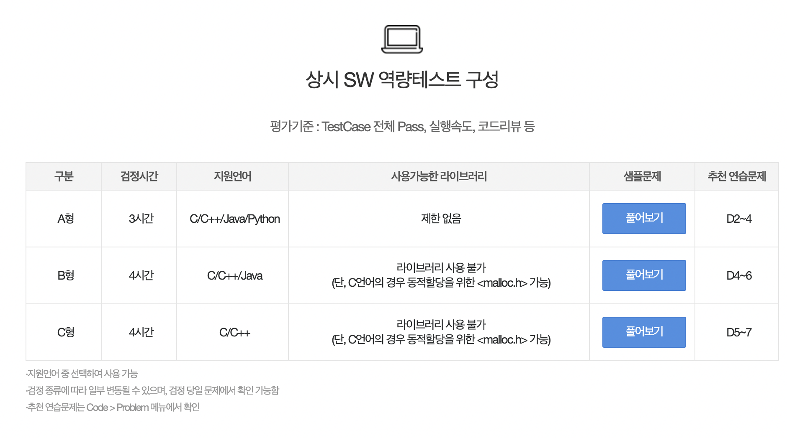
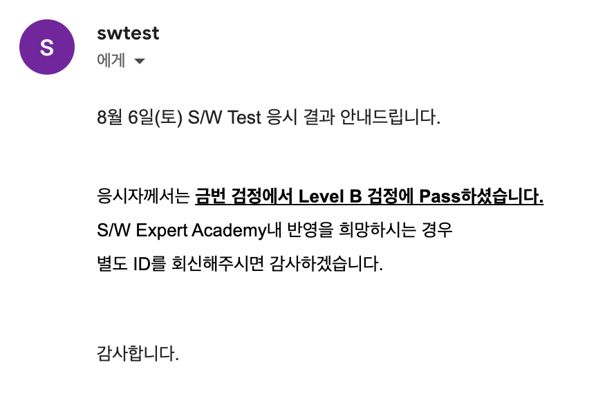

# 섬성 S/W 역량테스트 후기
S/W 알고리즘 역량 강화 과정에서 검증 시험을 1회 이상 치뤄야 했기에 매도 먼저 맞는다는 마인드로 신청을 했다.
전날에 S/W Certificate 검정 안내도 받았고, TF 멘토분들께서 온라인 멘토링도 진행하셨다.

일단 대학생 역량강화 특강의 목표가 Professional 검정 시험을 대비였기에 A형(Adavanced) 시험을 보지 않더라도 B형(Professional) 시험을 볼 수 있었다.




아직도 공식 홈페이지에는 B형 시험에 라이브러리 사용 불가라고는 하지만 이제는 사용이 가능하다.~~암튼 좋은 거임~~

시험장에서 사용가능한 Tool은 다음과 같다
```
가능 : Visual Studio, Eclipse, Pycharm, 계산기, 모메장
불가능 : 인터넷 사용, 엑셀 
```
그리고 빈 종이 2장과 볼펜을 제공한다. 

Advanced에서는 완전탐색(?)이 가능할 수도 있다고한다. 물론 느낌상 희방한 가능성인듯 하지만 Professional 검정 시험에서는 완전탐색을 통한 물제 풀이는 없다고 한다. 

시험 시간 4시간 = 1.5 설계 + 2 구현 + 0.5 최적화 정도로 계획을 짜야한다고 한다.

문제 이해와 출제자의 의도 파악 + 정확하고 빠른 구현 역량이 필요하다고 한다. 좀더 설명을 하자면  빨간색으로 강조한 부분을 잘 읽어야 하고 제약 사항을 보고 연산을 줄여야한다. 정말로 단적의 예를 들자면 탐색 자료량이 10000이 넘어가면 완전 탐색 O(N^2) 사용하면 시간초과가 날 수 있다.

또한 상대평가가 아닌 절대평가라고 한다. 1문제 푸는건데 상대평가면... ~~양아치~~ 

기본적인 자료구조, 알고리즘을 알아야 한다. 물론 시험장에 reference로 기본적인 자료구조와 알고리즘에 대한 설명이 있어서 혹여나 구체적인 알고리즘 구현을 순간 까먹더라도 reference를 통해서 어느 정도 커버가 가능하다. 개인적으로 이런 편의 너무 좋다...
```
자료구조 : Stack, Queue, Hash, Priority Queue, Trie, linked List, Tree

알고리즘 : Quick Sort, Merge Sort, BFS, DFS, DP, Dijstra...

```
이 중에서 자료구조에서는 Hash와 Priority Queue, Linked List, Tree. 알고리즘에서는 DP와 이분탐색이 중요하다고 한다.

<br>

### 시험 대비로는 구현 연습이 중요하다.

변수 초기화 주의를 해야하고 -> 테스트 케이스 마다 반복해서 사용하는 변수를 초기화 잘해야한다.

메모리 크기를 넘지 않게 변수를 선언(stack, heap메모리 크기 주의) → 재귀 함수 쓰면 stack overflow 날 수 있으니 조심조심.

메모리 풀 vs ~~동적 할당~~ 메모리 풀을 선호하자.

STl을 활용해서 문제를 풀어도 괜찮지만 시간 제약이 백준보다 좀더 빡빡한 경우가 많다(그래서 최적화가 중요하다 테스트 케이스를 통과해도 최적화에서 점수를 못 받아서 결국 B형을 합격 못하는 케이스가 많다고 한다). 그래서 STL은 구현 스피드가 좋고 편리하지만 제대로 알고 쓰자고 한다. ~~아직 제대로 알고 쓰자는 잘 모르겠다. 아마 각 STL에서 제약 조건 처리를 의미한는 것 같다 아마도...~~ STL 사용이 가능하지만 직접 구현한 게 더 빠를 수 있다 일단 STL을 사용해서 풀고 정답이 나오면 직접 구현한 걸로 교체하는 방식으로 전략을 짜자. 테스트 케이스 잘 돌아가고 시간 남으면, 집 가지 말고 코드 개선을 하도록 하자

중요한 것은 시간 복잡도, 개선 할 수 있는 logic 개선하기. 테스트 케이스 중 가장 큰 테스트 케이스를 여러번 복사해서 테스트하자. 생각하지 못한 부분에서 에러가 발생하진 않을 지 고민해보기
마지막으로 IDE 디버깅 툴 적극 활동

<br>

## 내가 느낀 이번 시험
평소에 이분 탐색에 벽을 느껴서 지난 1주일 동안 이분 탐색을 열심히 ~~조졌더니~~ 운 좋게 시험 문제를 이분 탐색으로 풀 수 있었던 것 같다. 첫번째 입력값를 기준으로 나머지 10만개의 데이터를 이분탐색으로 상대적 위치를 구하고 DP는 아지만 추가 메모리를 사용해서 상대적 위치가 같은 것 끼리 후보를 저장하고 풀이를 진행 했더니 나름 빠른 결과가 나온것 같았다. 아마도... 결과는 1주일 후에 나온다고 하니 결과를 봐야 내 풀이가 최적인지 아닌지를 알 수 있을 것 같다. 

<br>
<br>

***

## 추가 2022 08 10
결과 발표까지 일주일이 걸린다고 해서 SW 특강 수료라도 하자는 마인드로 80%의 기초문제 풀이와 강의 수강을 했다. 

운좋게 통과를 받았다
결과론적으로 봤을 때 결국 이분 탐색이 정답이었던 것 같다

그전까지 많은 코테를 도전했지만 늘 광탈만 했었다.
생애 첫 코딩테스트 통과가 삼성이라고 생각하니 기분이 좋다... 입사 시험이었으면 좋았을 것을... 하지만 객관적으로 봤을 때 이번 시험은 단순히 운이 좋아서 통과를 했기 때문에 더욱 열심히 해겠다는 다짐을 했다.


