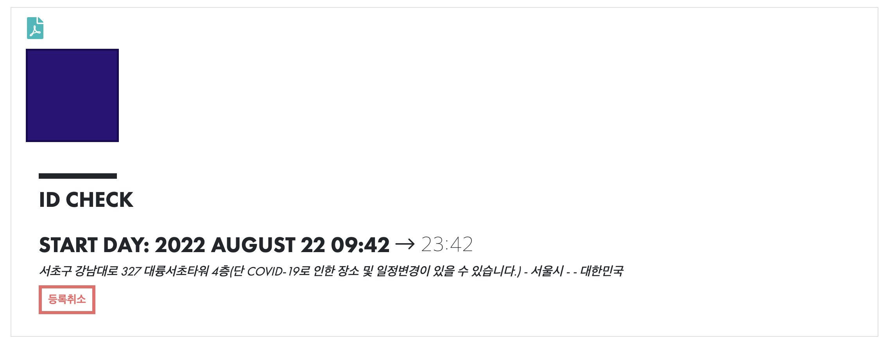
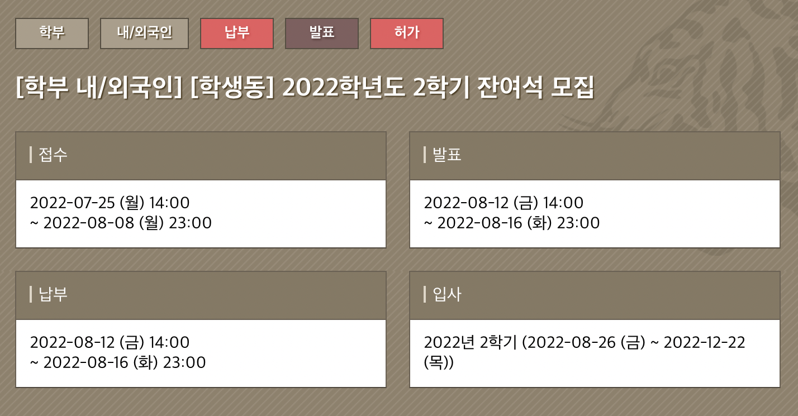

## 기회

월요일에 42서울 라피신을 신청했다. 
결과는 다행히 신청 완료! 지난 주에 우울했던 기운이 2년 이상 기다려왔던 라피신을 신청함으로써 조금 사라졌다.

어쩌면 새로운 사람들을 만난다는 호기심(?)이 자극이 된 것일 수도 있고, 새로운 환경에 처해지는 기대감일 수 도 있다는 생각이 들었다.

 

금요일에 기대조차 안했던 기숙사 잔여석에 선발 되었다. 1,2 학년 위주로 뽑는다고 했는데 운 좋게 합격을 한 것 같았다. 어쩌면 이유가 있어서 남은 것 일수도...

왕복 여유있게 왕복 2시간 반? 이라는 시간을 아낄 수 있어 조금은 다행이라고 생각했다. 또한 이번에 시간표에 1교시가 많아서 운이 좋은 것 같다. 

## 하던 것 부터 마무리 잘 하자

화요일에 삼성 S/W 역량 테스트 결과가 나왔다. 물론 운 99.99%로 합격을 했지만  나도 어쩌면 가능성이 있을 지도 라는 생각에 우울했던 감정이 ~~완전히~~ 많이 사라진 것 같았다. 물론 알고리즘 역략강화 과정의 문제들은 언제나 나를 괴롭힌다... 

그 밖에 시간들은 PS 하면서 시간을 보냈다. 수료 조건이 문제풀이 80%인데 간당간당하게 떨어질 위기이다... PS도 어렵지만 최적화도 무시무시하다.

